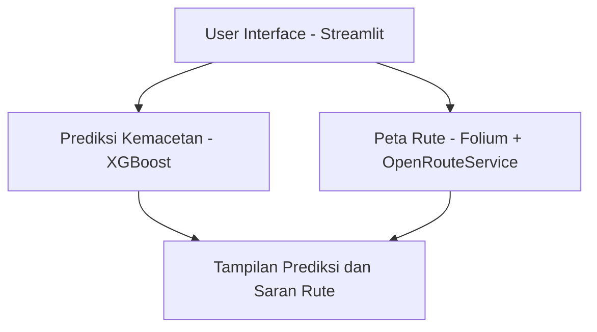
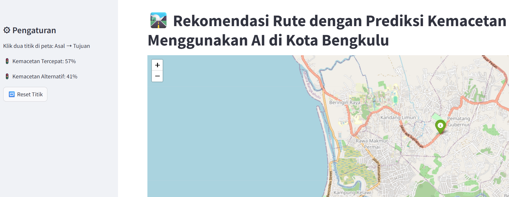
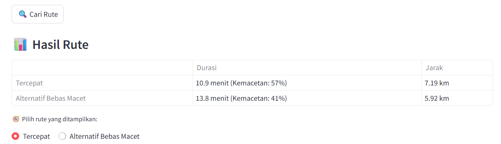
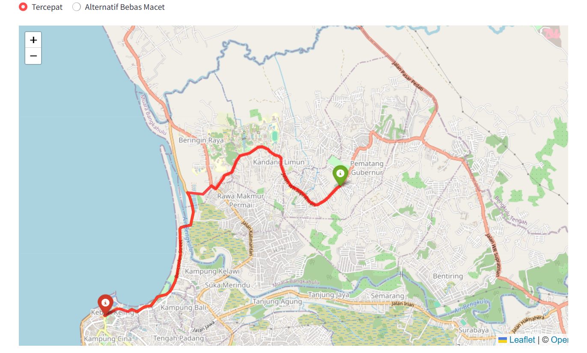
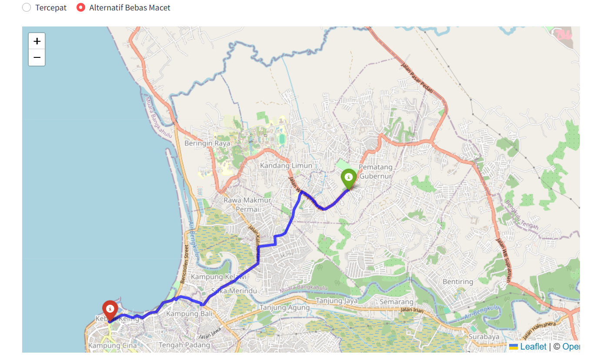
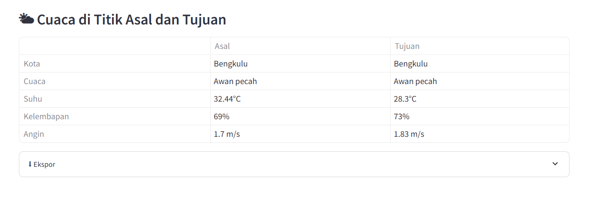

# SMARTCITY-TRAFFIC 🚦

Sistem prediksi kemacetan lalu lintas dan rekomendasi rute alternatif berbasis AI untuk mendukung program Smart City di Kota Bengkulu.

## 📌 Deskripsi Proyek

SMARTCITY-TRAFFIC adalah aplikasi berbasis web yang dikembangkan dengan Streamlit dan Folium untuk memvisualisasikan data lalu lintas serta memberikan prediksi tingkat kemacetan secara real-time. Sistem ini juga dapat memberikan rekomendasi rute alternatif menggunakan layanan OpenRouteService.

## 🎯 Tujuan Proyek

* Memprediksi tingkat kemacetan lalu lintas berdasarkan parameter lingkungan dan lalu lintas aktual.
* Memberikan peringatan dini terhadap potensi kemacetan.
* Menyediakan rekomendasi rute alternatif bagi pengguna jalan.

## 🔍 Studi Kasus

Kota Bengkulu, sebagai bagian dari pengembangan Smart City, membutuhkan sistem yang mampu menganalisis dan merespon kondisi lalu lintas secara cerdas dan cepat.

## 🧠 Model Kecerdasan Buatan

Model AI yang digunakan:

- **XGBoost Regressor**

  **Alasan pemilihan:**

  - Performa tinggi untuk data tabular.
  - Mampu menangani fitur non-linear dan interaksi antar fitur.
  - Cepat dan efisien untuk inferensi real-time.

## 📊 Dataset

### Sumber Data

- Simulasi data lalu lintas Kota Bengkulu yang disimpan di `model/traffic_data.csv`

### Fitur Dataset

| Fitur          | Keterangan                     |
| -------------- | ----------------------------- |
| datetime       | Waktu pengamatan              |
| distance_km    | Jarak perjalanan (kilometer)  |
| num_segments   | Jumlah segmen jalan           |
| temperature    | Suhu udara (°C)               |
| rain           | Intensitas hujan (0–3)        |
| traffic_level  | Tingkat kemacetan (target)    |

### Praproses Data

- Ekstraksi fitur waktu (jam, hari, dll).
- Normalisasi/standardisasi data numerik.
- Pembagian data menjadi train dan test.

## ⚙ Arsitektur Sistem



### Alur Kerja Sistem

1. Pengguna memasukkan waktu dan parameter lalu lintas.
2. Sistem memprediksi tingkat kemacetan menggunakan model AI.
3. Jika kemacetan tinggi, sistem memberikan rekomendasi rute alternatif menggunakan OpenRouteService.

## 📈 Evaluasi Model

* **Metrik Evaluasi:**

  * Mean Absolute Error (MAE)
  * Root Mean Squared Error (RMSE)
  * R² Score

* **Strategi Evaluasi:**

  * Pembagian data train-test 80:20.
  * Validasi silang (cross-validation) selama pelatihan model.

## 🧩 Struktur Proyek

```
SMARTCITY-TRAFFIC/
│
├── app.py                         # Aplikasi utama Streamlit
├── requirements.txt               # Daftar dependensi
├── README.md                      # Dokumentasi proyek
│
├── model/
│   ├── traffic_data.csv           # Dataset lalu lintas
│   ├── traffic_model.joblib       # Model terlatih (joblib)
│   ├── traffic_model_xgboost.json # Model terlatih (XGBoost JSON)
│   ├── train_model.py             # Script pelatihan model
│   └── model_metadata.json        # Metadata model
```

## ▶ Cara Menjalankan

### 1. Clone Repository

```bash
git clone https://github.com/NamaKelompok/SMARTCITY-TRAFFIC.git
cd SMARTCITY-TRAFFIC
```

### 2. Install Dependencies

```bash
pip install -r requirements.txt
```

### 3. Jalankan Aplikasi

```bash
streamlit run app.py
```

## 🖼️ Contoh Visualisasi Aplikasi

Berikut adalah beberapa tangkapan layar dari antarmuka aplikasi SMARTCITY-TRAFFIC-BENGKULU:

### 🔄 Prediksi Kemacetan & Rekomendasi Rute
Visualisasi untuk memilih rute tercepat dan rute alternatif berdasarkan prediksi tingkat kemacetan oleh model AI.



---

### 📊 Evaluasi Tingkat Kemacetan
Visualisasi evaluasi model prediksi yang menunjukkan akurasi dan status kemacetan.



### 🗺️ Tampilan Peta Rute
Peta interaktif yang menampilkan jalur tercepat (garis merah).



---

### 🗺️ Tampilan Peta Rute
Peta interaktif yang menampilkan rute alternatif bebas macet (garis biru).



### 🌤️ Informasi Cuaca Real-Time
Cuaca di titik asal dan tujuan yang digunakan sebagai fitur dalam model prediksi.



---

## 🔮 Rencana Pengembangan

### ✅ Fitur yang Akan Ditambahkan

* **Integrasi Data Real-Time Lalu Lintas**
  Mengambil data kemacetan dari API seperti Google Maps Traffic atau HERE Traffic (jika tersedia untuk wilayah Bengkulu), serta membandingkan prediksi model dengan data real-time.

* **Opsi Algoritma Alternatif**
  Menambahkan algoritma pencarian rute seperti Dijkstra atau A\* sebagai alternatif OpenRouteService.

* **Analisis Perbandingan Rute**
  Visualisasi perbandingan rute tercepat, terpendek, dan paling sedikit kemacetan, termasuk heatmap kemacetan di peta.

* **Riwayat dan Logging Penggunaan**
  Penyimpanan riwayat rute dan prediksi sebelumnya, serta logging aktivitas pengguna untuk analisis performa dan preferensi.

* **Training Ulang Model AI**
  Halaman upload dataset baru dan pelatihan ulang model XGBoost secara langsung dengan evaluasi performa.

* **Versi Mobile Responsive**
  Membuat tampilan UI yang ramah perangkat mobile dan tablet.

* **Integrasi IoT dan Sensor**
  Mendukung data input dari sensor lalu lintas atau kamera CCTV untuk prediksi yang lebih akurat (jika tersedia).

## 🚀 Pengembangan Lanjutan

* Integrasi data real-time dari API lalu lintas (Waze, Google Traffic, atau IoT).
* Penambahan notifikasi berbasis lokasi.
* Visualisasi heatmap kemacetan.
* Integrasi dengan sistem transportasi umum dan peringatan cuaca ekstrem.

---
